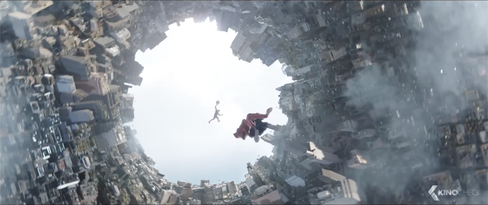
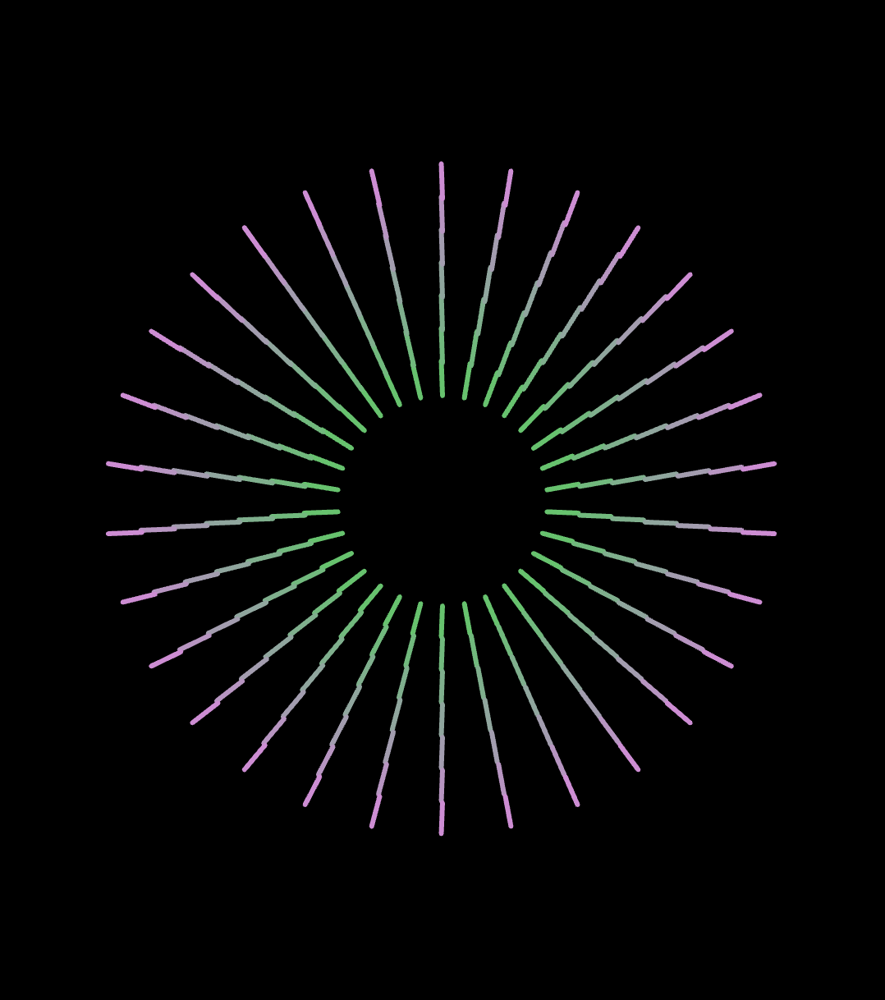
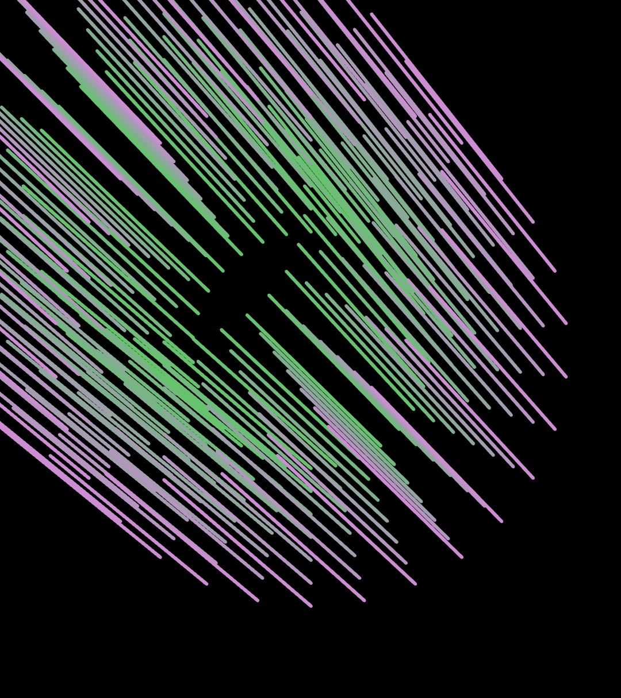

# suli0089_9103_tut1

## Quiz 8
### Imaging Technique Inspiration

I was inspired by the kaleidoscope effect from the movie *Spider-Man: No Way Home*, during the mirror dimension fight between Spider-Man and Dr. Strange. It uses repeating, symmetrical patterns that are visually appealing and intriguing. 

A kaleidoscope pattern is created when multiple reflections create repeated symmetrical patterns in rounds, which is reminiscent of Pacita Abad’s “Wheels of Fortune”. I intend to incorporate symmetrical and dynamic abstract patterns into my project. This technique is beneficial as the kaleidoscope effect creates intricate designs and enhances the complexity through symmetry and movement, creating a visually compelling and dynamic artwork.

### Coding Technique Exploration

The coding technique that could be used is the kaleidoscope effect in this [p5.js sketch by NanoDano](https://editor.p5js.org/NanoDano/sketches/RcaQMowzv). This code creates a dynamic, intricate pattern with lines and symmetry. 

It creates a kaleidoscope effect as the lines are circularly arranged. User input enables interaction through mouse movements, as the pattern changes depending on the mouse’s position, creating a dynamic experience with movement. The zoom animation scales the design, creating depth while showing intricate details of the lines. The different interactive elements enhance the visual experience, creating an interesting and lively design. 

> Cursor at centre

> Cursor at top left

